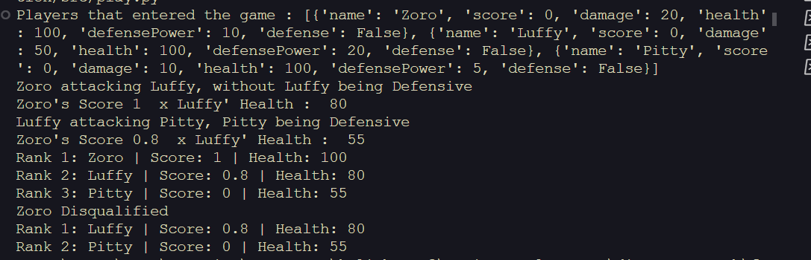

[](https://classroom.github.com/a/t33mmfzf)
# # Final Project Soal ke - 3 Function & Sorting - Math Diskrit RKA'24

#### Deskripsi Penugasan:
Kerjakan sebelum deadline : 4 Desember 2024 23.59 WIB
Anda diminta untuk membuat dan mengimplementasikan beberapa fungsi untuk mengelola dan mengatur pemain dalam permainan berbasis Python. Fungsi-fungsi yang akan dibuat mencakup pembuatan, penambahan, penghapusan, dan manipulasi status pemain dalam sebuah daftar pemain. Setiap pemain diwakili oleh sebuah dictionary yang menyimpan atribut seperti nama, skor, kesehatan, kekuatan serangan, dan status pertahanan :

```python
Player = dict(name="",
              score=0,
              damage=0,
              health=100,
              defensePower=0,
              defense=False)
```

Buat file `game.py` kemudian implementasikan fungsi - fungsi di bawah ini :

1. **`initPlayers()`** :
   * Fungsi ini digunakan untuk menginisialisasi daftar pemain. Daftar pemain akan disimpan dalam variabel global`PlayerList`, yang dimulai dengan list kosong.
   * **Parameter** : Tidak ada.
   * **Output** : Menginisialisasi`PlayerList` sebagai list kosong.
   * Pastikan scoop PlayerList accessible di dalam function lain
2. **`createNewPlayer(name, damage=0, defensePower=0)`** :
   * Fungsi ini digunakan untuk membuat pemain baru dengan atribut dasar seperti nama, kerusakan, dan kekuatan pertahanan. Pemain juga memiliki skor awal 0, kesehatan 100, dan status pertahanan yang diset ke`False`.
   * **Parameter** :
     * `name` (str, default ""): Nama pemain.
     * `damage` (int, default 0): Kekuatan serangan pemain.
     * `defensePower` (int, default 0): Kekuatan pertahanan pemain.
   * **Output** :
     * Mengembalikan sebuah dictionary yang mewakili pemain dengan atribut-atribut seperti`name`,`score`,`damage`,`health`,`defensePower`, dan`defense`.
3. **`addPlayer(player)`** :
   * Fungsi ini digunakan untuk menambahkan pemain yang telah dibuat ke dalam`PlayerList`.
   * **Parameter** :
     * `player` (dict): Pemain yang ingin ditambahkan ke dalam daftar pemain.
   * **Output** :
     * Menambahkan pemain ke dalam`PlayerList`.
4. **`removePlayer(name)`** :
   * Fungsi ini digunakan untuk menghapus pemain dari`PlayerList` berdasarkan nama pemain. Jika pemain tidak ditemukan, akan mencetak pesan error yaitu `.
   * **Parameter** :
     * `name` (str): Nama pemain yang ingin dihapus.
   * **Output** :
     * Jika pemain ditemukan, pemain dihapus dari`PlayerList`. Jika pemain tidak ditemukan, mencetak pesan "There is no player with that name!".
5. **`setPlayer(player, key, value)`** :
   * Fungsi ini digunakan untuk memperbarui nilai dari atribut tertentu di dalam dictionary pemain. Fungsi ini memungkinkan kita untuk mengubah nilai dari atribut seperti skor, kesehatan, dan lainnya.
   * **Parameter** :
     * `player` (dict): Pemain yang atributnya akan diperbarui.
     * `key` (str): Nama atribut yang ingin diubah.
     * `value`: Nilai baru untuk atribut tersebut.
   * **Output** :
     * Memperbarui atribut di dalam dictionary pemain sesuai dengan key dan value yang diberikan.
6. **`attackPlayer(attacker:dict, target:dict)`** :
   * Fungsi ini digunakan untuk melakukan serangan dari pemain penyerang ke pemain target. Jika target sedang dalam mode pertahanan (`defense=True`), maka perhitungan serangan akan dipengaruhi oleh kekuatan pertahanan target. Skor penyerang akan bertambah, dan kesehatan target akan berkurang sesuai dengan perhitungan.
   * Pastikan untuk merubah nilai atribut anda menggunakan methode setter yang sudah dibuat dan untuk melatih pemahaman function, anda dilarang menggunakan accessible key modifier dari dictionary.
   * **Parameter** :
     * `attacker` (dict): Pemain yang menyerang.
     * `target` (dict): Pemain yang diserang.
   * **Output** :
     * Memperbarui nilai`score` untuk penyerang dan`health` untuk target. Status pertahanan target juga akan diubah menjadi`False` setelah serangan.
7. **`displayMatchResult()`** :
   * Fungsi ini digunakan untuk menampilkan hasil pertandingan, mengurutkan pemain berdasarkan skor dan kesehatan dalam urutan menurun (descending). Pemain dengan skor tertinggi akan ditempatkan di peringkat pertama.
   * **Parameter** : Tidak ada.
   * **Output** :
     * Menampilkan hasil akhir pertandingan berupa daftar pemain yang diurutkan berdasarkan skor tertinggi dan kesehatan tertinggi, beserta peringkat, nama pemain, skor, dan kesehatan mereka.

Kemudian simulasikan hasil function yang sudah anda buat di dalam file `play.py`, berikut adalah contoh hasil / tampilan uji coba program, anda dibebaskan untuk berkreasi / menambahkan tampilan dalam uji coba program


Untuk menjalankan unit testing (memvalidasi apakah program anda sudah sesuai atau belum) jalankan command :

```shell
python -m unittest discover -s test -p "*.py"
```
